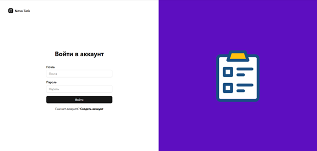
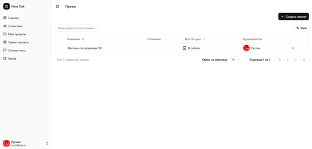
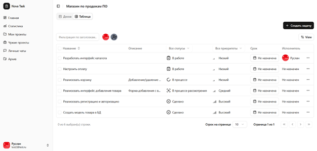
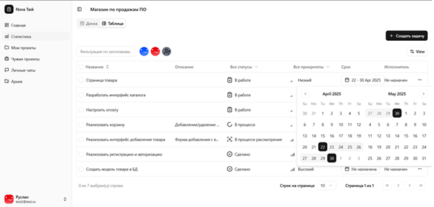
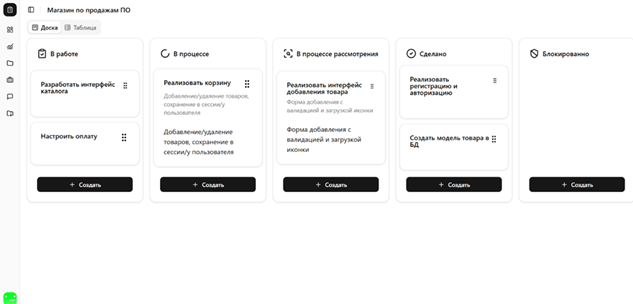

# Проект для управления проектами и задачами

## 🚀 Запуск приложения

### 1. Запуск бэкенда (NestJS) с помощью Bun

cd backend
bun install — установка зависимостей
bun run start:dev — запуск сервера в режиме разработки

### 2. Запуск фронденда (NextJS) с помощью Bun

cd frontend
bun install — установка зависимостей
bun run dev — запуск фронтенда

Клиент доступен на: http://localhost:3000

## 🖼️ Скриншоты
### Страница авторизации

### Страница проекта

### Страница задачи

### Страница задачи в виде канбан-доски
